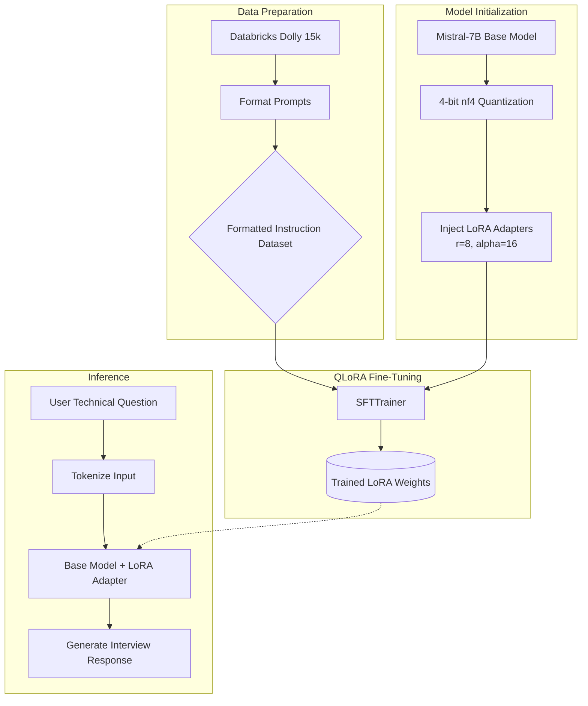

# 🤖 Mistral-7B Technical Interview Assistant 


This repository contains the complete end-to-end pipeline for fine-tuning the **Mistral-7B-v0.1** foundational model into a specialized technical interview assistant. The model has been instruction-tuned to ask technical questions, evaluate candidate responses, and provide structured feedback.

## 🏗️ Architecture & Workflow Diagram

GitHub automatically renders the flowchart below to demonstrate the training and inference pipeline:



System Architecture (Text Sketch)

```
===================================================================
                       TRAINING PIPELINE
===================================================================
[ Databricks Dolly 15k ]  ------>  [ Prompt Formatting ]
                                          |
                                          v
+-------------------+             +-------------------+
| Mistral-7B Base   |             | SFTTrainer        |
| Model (Frozen)    |             | (Paged AdamW)     |
+-------------------+             +-------------------+
          |                               ^
          v                               |
+-------------------+                     |
| 4-Bit Quantization|                     |
| (BitsAndBytes)    |                     |
+-------------------+                     |
          |                               |
          v                               |
+-------------------+                     |
| LoRA Adapters     | --------------------+
| (r=8, alpha=16)   |
+-------------------+
          |
          v
===================================================================
                      INFERENCE PIPELINE
===================================================================
[ Base Model ] + [ LoRA Adapter ] ---> [ Interview Output ]

```
⚙️ Hyperparameter Configuration
Quantization: 4-bit NormalFloat (```nf4```) with double quantization.

LoRA Rank (```r```): 8

LoRA Alpha: 16

LoRA Dropout: 0.05

Target Modules: ```q_proj```, ```k_proj```,``` v_proj```,``` o_proj```, ```gate_proj```,```up_proj```, ```down_proj```

📂 Repository Structure
```train.py```: The SFTTrainer script handling data tokenization, 4-bit quantization setup, and the QLoRA training loop.

```inference.py```: The evaluation script to load the base Mistral model, attach the trained LoRA adapter weights, and stream generated responses.

```requirements.txt```: Required Python dependencies for reproducibility.

🚀 Installation & Setup

1. Clone the repository:
```
git clone [https://github.com/YOUR_USERNAME/YOUR_REPO_NAME.git](https://github.com/YOUR_USERNAME/YOUR_REPO_NAME.git)
cd YOUR_REPO_NAME
```

2. Install dependencies:

```
pip install -r requirements.txt
```

3. Run Inference:
4. 
Ensure you have the trained ```interview-assistant-lora``` adapter weights downloaded to your local directory, then run:

```
python inference.py
```

---
```
Developed By Himanshu Dulhe
```
